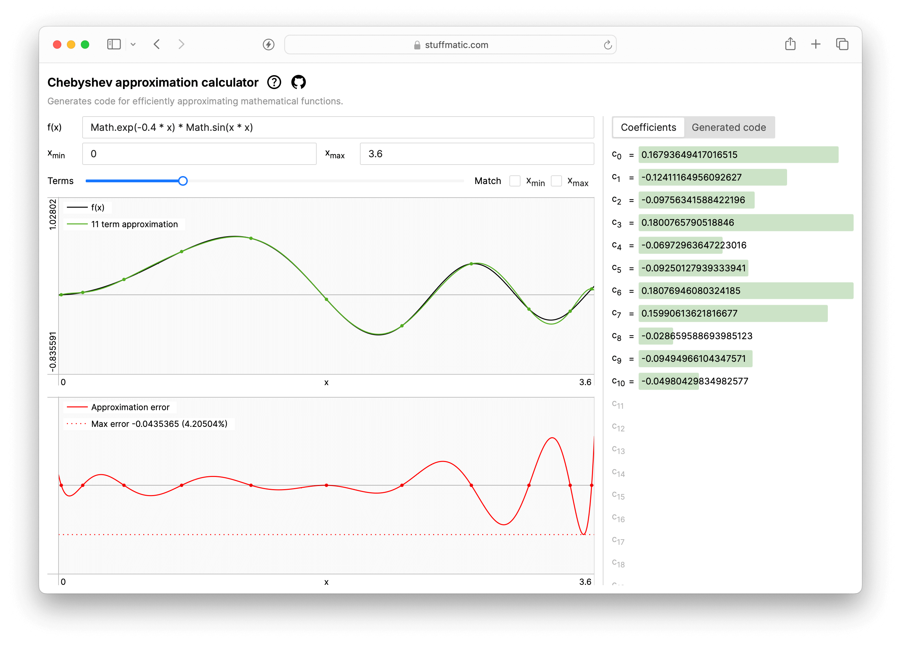

# Chebyshev approximation calculator

This is a web app that generates code for efficiently approximating mathematical functions of one variable. This can for example be useful in resource constrained environments like embedded systems, where standard math functions are either not available or prohibitively expensive to evaluate. The app can currently export C, Python and Rust code.

Functions are approximated using so called [Chebyshev expansions](https://en.wikipedia.org/wiki/Chebyshev_polynomials), which are numerically well behaved and can be [evaluated very efficiently](https://en.wikipedia.org/wiki/Clenshaw_algorithm). From a programmer's point of view, a Chebyshev expansion is just an array of coefficients that is passed to a simple function that iterates over them to evaluate the approximation. For smooth enough target functions, the coefficients quickly approach zero and only a few are needed to get a close approximation.

## Usage

1. Enter the function you want to approximate as a valid Javascript expression of the variable `x`, for example `Math.cos(x)`.
2. Specify the range to approximate using the x min and x max fields.
3. Drag the "terms” slider until the error graph shows an acceptable maximum error. This controls the number of terms of the Chebyshev expansion.
4. Go to the "Generate code" tab, select a language and copy the code to the clipboard. 

### Pro tips

* If your function is not smooth enough to get a close approximation with a reasonable number of coefficients, consider splitting the range into smaller intervals and compute separate approximations for each of them.
* The target function in the web app can be any valid Javascript expression of `x`. If your function is too complex to be expressed as a one-liner, you may want to consider using the self contained [`ChebyshevExpansion`](src/util/chebyshev-expansion.ts) class in your own Typescipt codebase.

## Building and running

The app is built with [React](https://react.dev/), [Typscript](https://www.typescriptlang.org/), [Vite](https://vitejs.dev/) and [Yarn](https://yarnpkg.com/). Run `yarn` to install dependencies, then `yarn dev` to start the dev server which serves the app on the URL displayed in the terminal. See [`package.json`](package.json) for other available commands.